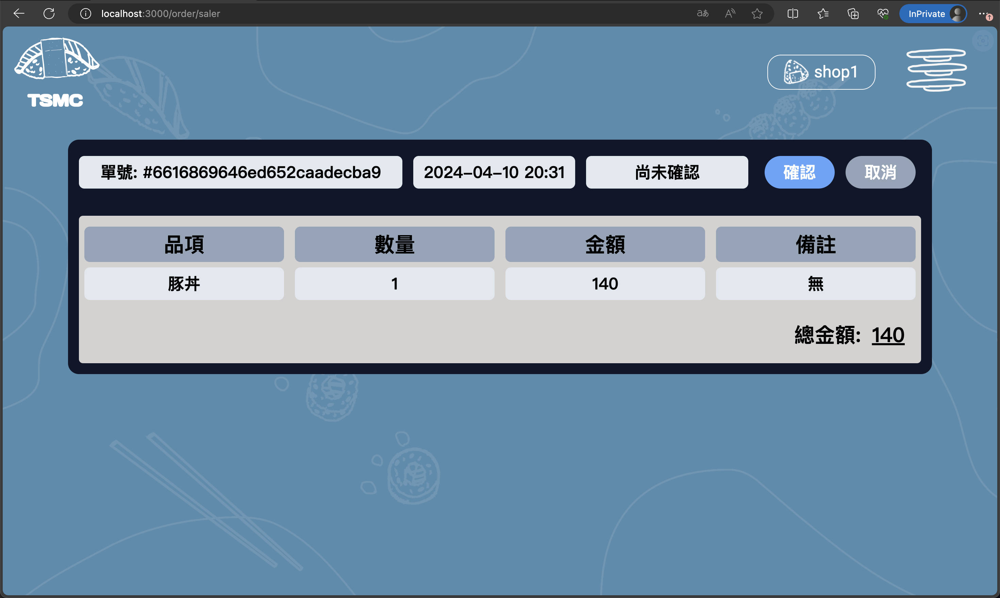

## Prerequisites
* Git
* Node.js
* Yarn

## Backend Setup
Open a terminal window and run the following commands:
1. Clone the repository:
    ```
    git clone git@github.com:VvnChengg/Meal-Order-WebApp.git
    ```

2. Navigate to the backend directory:
    ```
    cd Meal-Order-WebApp/backend
    ```

3. Copy the environment variables file. Use the appropriate command for your operating system:
* **Windows**: 
    ```
    copy .env.exmaple .env
    ```
* **Linux/Mac**:
    ```
    cp .env.exmaple .env
    ```

4. Install the dependencies:
    ```
    yarn
    ```

5. Start the development server:
    ```
    yarn dev
    ```

## Frontend Setup
In a new terminal window, execute the following steps to set up the frontend:

1. Navigate to the frontend directory:
    ```
    cd Meal-Order-WebApp/frontend
    ```

2. Install the dependencies:
    ```
    yarn
    ```

3. Start the frontend development server:
    ```
    yarn start
    ```

## Screenshots


